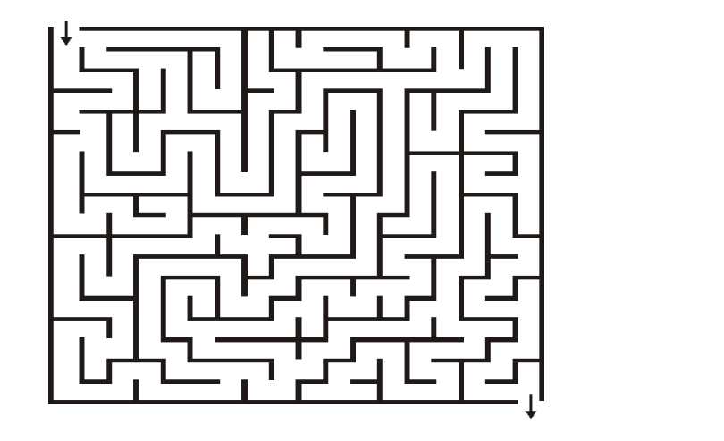

# <p align="center">🧩 Labyrinth-OS</p>

<p align="center">
  
  
  
  
</p>

---

<p align="center">
  
</p>

### <p align="center">🚀 Advanced Maze Generation & Pathfinding Visualizer</p>

**Labyrinth-OS** is a high-performance algorithmic engine designed to visualize the beauty of maze generation and solving. Engineered with Python, it provides a real-time, interactive exploration of classic graph algorithms, from Recursive Backtracking to A* Search.

---

## 🌟 Core Pillars

### 🧩 Generative Intelligence
Experience the creation of complex labyrinths using industry-standard algorithms:
- **Recursive Backtracking**: Depth-first search approach for long, winding paths.
- **Prim's Algorithm**: Creating natural, spanning-tree based structures.
- **Kruskal's Algorithm**: Randomized wall-removal for perfect mazes.

### 🔍 Intelligent Pathfinding
Watch how different solvers navigate the complexity in real-time:
- **A* Search**: Optimized heuristic-based exploration for the shortest path.
- **Dijkstra's Algorithm**: Guarantees the mathematical shortest route.
- **BFS & DFS**: Classic breadth-first and depth-first exploration strategies.

### 🎨 High-Fidelity Visualization
- **Terminal Graphics**: Modern ANSI-powered terminal output for instant feedback.
- **Step-by-Step Animation**: Controlled playback to understand algorithmic decisions.
- **Export Engine**: Generate high-resolution PDF and PNG maps of your generated mazes.

---

## 📁 Premium Structure

```text
Labyrinth-OS/
├── assets/             # Branding and maze save states
│   └── screenshots/    # High-resolution UI captures
├── docs/               # Technical documentation and exported mazes
├── src/
│   └── engine/         # Core algorithmic implementations
│       ├── maze.py     # Main entry point
│       └── ...         # Specialized solvers and generators
└── README.md           # Professional landing page
```

---

## 🛠️ Technical Foundation

- **Core Engine**: Pure Python 3.10+ optimized for computational efficiency.
- **Data Structures**: Custom Graph and Adjacency List implementations.
- **Serialization**: JSON-based maze persistence for sharing and re-solving.
- **Graphics**: Optimized terminal rendering and vector export via ReportLab.

---

## 🚀 Instant Start

```bash
# Clone the repository
git clone https://github.com/HayreBuilds/Labyrinth-OS.git

# Enter the workspace
cd Labyrinth-OS

# Run the visualizer
python3 src/engine/maze.py
```

---

## 📄 License

This project is licensed under the MIT License. See the [LICENSE](LICENSE) file for details.

---

<p align="center">
  Crafted with algorithmic precision by <a href="https://github.com/HayreBuilds">Hayredin Mohammed</a>
</p>
